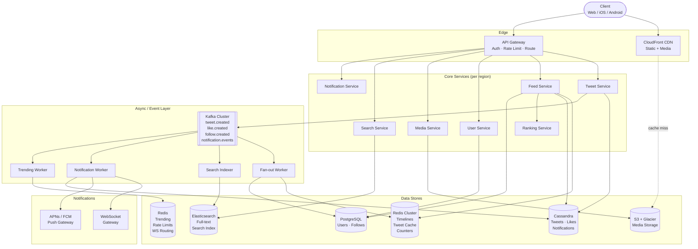

# Twitter / X — System Design

> **Interview format:** 45–60 min | **Scale target:** 500M DAU, global
> **Type:** Social media platform — tweets, follow graph, home feed, search, notifications

---

## Interview Pacing Guide

| Phase | Time | Section |
|---|---|---|
| Requirements & Scope | 0–5 min | §1 |
| Back-of-Envelope | 5–10 min | §2 |
| High-Level Architecture | 10–20 min | §3 |
| Deep Dives | 20–50 min | §4.1 – §4.8 |
| Failure Scenarios & Trade-offs | 50–55 min | §5 |
| Wrap-up & Follow-up Questions | 55–60 min | §6 |

---

## §1 — Requirements & Scope (5 min)

### Functional Requirements
1. **Create tweets** — text (up to 280 chars) + optional media (images, GIFs, short video).
2. **Follow / Unfollow users** — directed graph; follower sees followee's tweets in their feed.
3. **Home timeline** — personalized, reverse-chronological (with optional ranking) feed of tweets from accounts the user follows.
4. **Interactions** — like, retweet, quote-tweet, reply.
5. **Notifications** — real-time alerts for likes, replies, retweets, follows, mentions.
6. **Search** — full-text search over tweets, users, and hashtags.
7. **Trending topics** — globally and per-region, updated near real-time.
8. **Infinite scroll** — pagination without gaps or duplicates as new tweets arrive.
9. **User profiles** — view a user's tweet history.

### Non-Functional Requirements
| Property | Target |
|---|---|
| Availability | 99.99% (< 1 hr downtime/year) |
| Feed P99 latency | < 200 ms end-to-end |
| Timeline freshness | Tweets visible in feed within 5 s of creation (p99) |
| Consistency | Eventual — like counts and feed order can lag; no money involved |
| Durability | Tweets and media persisted to ≥ 3 replicas before ACK |
| Global reach | Active in every geography; tolerate single-region outages |
| Scale | 500M DAU, ~2B MAU |

### Out of Scope
- Authentication & OAuth internals (assumed solved at API gateway layer)
- Ad targeting and auction system
- ML model training for feed ranking (treated as a scoring service call)
- Payments / Twitter Blue subscription billing
- Live Spaces / audio (mentioned in §6 as a follow-up)

---

## §2 — Back-of-Envelope Estimation (5 min)

### Traffic

```
DAU:                    500M users/day
MAU:                    ~2B users

--- Write QPS ---
Tweets created:         500M × 0.5  tweets/user/day  = 250M  /day  →  ~2,900  /sec avg
                                                                         ~10,000 /sec peak (3.5× spike)
Likes:                  500M × 5    likes/user/day   = 2.5B  /day  →  ~29,000 /sec avg
Retweets:               500M × 1    RT/user/day      = 500M  /day  →   ~5,800 /sec avg
Follows:                500M × 0.1  follows/user/day =  50M  /day  →     ~580 /sec avg
Notifications emitted:  roughly equal to likes + RTs + follows     →  ~35,000 /sec avg

--- Read QPS ---
Feed loads:             500M × 20   loads/user/day   = 10B   /day  →  ~115,000 /sec avg
                                                                         ~350,000 /sec peak
Tweet reads (permalink) 500M × 30   views/user/day   = 15B   /day  →  ~175,000 /sec avg
Search queries:         500M × 5    searches/user/day = 2.5B /day  →   ~29,000 /sec avg

Read:Write ratio ≈ 100:1  (heavily read-dominant)
```

### Storage

```
--- Tweet Text ---
Per tweet:              tweet_id (8B) + user_id (8B) + text (280B) + metadata (100B) ≈ 400 B
Daily new tweets:       250M × 400 B = 100 GB/day text
5-year retention:       100 GB × 365 × 5 ≈ 180 TB   (hot tier, Cassandra)
Historical archive:     additional 1.5 PB (cold, S3 Glacier)

--- Media ---
% tweets with media:    ~25% (images + GIFs + video)
Avg media size:         images ≈ 200 KB after re-encoding; video ≈ 5 MB
Daily media:            250M × 0.25 × 500 KB avg ≈ 31 TB/day written to S3
CDN offload:            ~90% of reads served from edge → S3 egress is 3 TB/day
5-year media storage:   31 TB × 365 × 5 ≈ 57 PB  (tiered: hot 6 mo, cold thereafter)

--- User Graph (follow relationships) ---
Avg follows per user:   ~200 following; ~200 followers  (median; power-law distribution)
Total follow edges:     2B users × 200 = 400B edges  →  400B × 16 B/edge ≈ 6.4 TB
Fits in PostgreSQL with partitioning + read replicas; not a graph DB scale problem.

--- Timeline Cache (Redis) ---
Keep last 800 tweet IDs per active user timeline
800 × 8 B (tweet_id) × 500M active users = 3.2 TB of raw sorted-set data
Real Redis footprint with overhead (sorted-set skiplist): ×3–4 → ~10–13 TB
Use Redis Cluster across 20–30 nodes (512 GB RAM each) sharded by user_id.

--- Notification Store ---
Per notification: ~200 B × avg 50 unread notifications × 2B users = ~20 TB
Stored in Cassandra; Redis caches unread counts.
```

### Bandwidth

```
Feed response payload:  20 tweet objects × 1 KB/tweet = 20 KB/request
Peak feed bandwidth:    350,000 req/s × 20 KB ≈ 7 GB/s egress (pre-CDN)
Media bandwidth:        CDN absorbs ~90%; origin egress ≈ 300 MB/s

Ingest (writes):
  Tweets:               10,000/s × 400 B   ≈   4 MB/s
  Kafka fan-out events: ~2–5 MB/s (tweet + follow events)
```

### Latency Budget (P99 feed load, same-region)

```
GeoDNS + TLS (warm connection)          5 ms
API Gateway routing                     2 ms
Feed Service → Redis timeline lookup    5 ms   (0.5 ms Redis + 4 ms network round-trip)
Celebrity tweet hydration (Cassandra)  20 ms   (if user follows any celebrity)
Tweet object hydration from cache      10 ms   (batch GET 20 IDs, Redis)
Ranking / scoring service call         15 ms   (lightweight feature vector, no deep ML)
Serialize + send response               3 ms
─────────────────────────────────────────────
Total P50:  ~40 ms    P99: ~160 ms   ✓ < 200 ms budget
```

---

## §3 — High-Level Architecture (10 min)

### Component Map

```
┌────────────────────────────────────────────────────────────────────────────┐
│                            CLIENTS                                         │
│           Web (React)   ·   iOS   ·   Android   ·   Third-party API        │
└──────────────────────────────┬─────────────────────────────────────────────┘
                               │ HTTPS / WSS
                               ▼
                    ┌──────────────────┐
                    │   CDN (Edge)     │  ← static assets, media, cached API responses
                    │  CloudFront/CF   │
                    └────────┬─────────┘
                             │ Cache miss
                             ▼
              ┌──────────────────────────┐
              │       API Gateway        │  — TLS termination, auth token validation,
              │  (Kong / AWS API GW)     │    rate limiting, request routing, observability
              └──────────┬───────────────┘
                         │
          ┌──────────────┼──────────────────────┐
          ▼              ▼                       ▼
  ┌─────────────┐ ┌─────────────┐       ┌───────────────┐
  │Tweet Service│ │ Feed Service│       │  User Service │
  │             │ │             │       │               │
  │• POST tweet │ │• GET /home  │       │• profile CRUD │
  │• GET tweet  │ │  timeline   │       │• follow graph │
  │• like/RT    │ │• ranking    │       │• search users │
  └──────┬──────┘ └──────┬──────┘       └───────┬───────┘
         │               │                       │
         │    ┌──────────┘                       │
         │    │                                  │
         ▼    ▼                                  ▼
  ┌─────────────────────────────────────────────────────┐
  │                     Kafka Cluster                    │
  │  Topics:                                             │
  │   tweet.created  · tweet.deleted  · like.created    │
  │   follow.created · notification.events              │
  │   media.uploaded · search.index                     │
  └──┬──────────┬──────────┬──────────┬─────────────────┘
     │          │          │          │
     ▼          ▼          ▼          ▼
 ┌────────┐ ┌────────┐ ┌────────┐ ┌────────────────┐
 │Fan-out │ │Search  │ │Notif.  │ │Analytics/      │
 │Worker  │ │Indexer │ │Worker  │ │Trending Worker │
 └───┬────┘ └───┬────┘ └───┬────┘ └───┬────────────┘
     │          │          │          │
     ▼          ▼          ▼          ▼
 ┌───────┐ ┌──────────┐ ┌──────┐ ┌──────────────┐
 │ Redis │ │  Elastic │ │Push  │ │Redis Trending│
 │(Time- │ │  Search  │ │Gate- │ │Sorted Set    │
 │ lines)│ │  Cluster │ │ way  │ │              │
 └───────┘ └──────────┘ │(WS/  │ └──────────────┘
                        │ SSE) │
                        │APNs  │
                        │FCM   │
                        └──────┘

Databases:
 ┌────────────────┐  ┌──────────────────┐  ┌──────────────────┐
 │  Cassandra     │  │   PostgreSQL      │  │   S3 + CDN       │
 │  • tweets      │  │   • users         │  │   • images       │
 │  • likes       │  │   • follows       │  │   • videos       │
 │  • notifs      │  │   (social graph)  │  │   • GIFs         │
 └────────────────┘  └──────────────────┘  └──────────────────┘
```

### End-to-End Flow A — Posting a Tweet

```
1.  Client  →  POST /api/v1/tweets
              { "text": "Hello world", "media_ids": ["m123"], "idempotency_key": "uuid" }

2.  API Gateway  →  validates JWT, checks rate limit (300 tweets / 3 h per user)
                 →  routes to Tweet Service

3.  Tweet Service:
    a. Validates text length, media_ids
    b. Generates tweet_id via Snowflake ID generator (64-bit, time-sortable)
    c. Writes tweet to Cassandra:
         INSERT INTO tweets (tweet_id, user_id, text, media_ids, created_at)
         VALUES (?, ?, ?, ?, now())
       Writes synchronously to LOCAL_QUORUM (2 of 3 replicas in region)
    d. Publishes to Kafka: topic=tweet.created, key=user_id
       (key ensures all tweets from same user go to same partition → ordered processing)
    e. Returns 201 Created { tweet_id, created_at } to client  ← fast path done

4.  Kafka Consumer — Fan-out Worker (async, within ~2s):
    a. Reads tweet.created event
    b. Queries Social Graph DB: SELECT follower_id FROM follows WHERE followee_id = $author
       (paginated if millions of followers; uses DB read replica)
    c. For each follower with <= 1K followers of their own (normal user):
         ZADD timeline:{follower_id} {tweet_id as score} {tweet_id}
         ZREMRANGEBYRANK timeline:{follower_id} 0 -801   ← trim to 800 entries
    d. Skips fan-out for "celebrity" followees (handled at read time — see §4.1)

5.  Kafka Consumer — Search Indexer (async, within ~5s):
    Indexes tweet text, hashtags, mentions, timestamp into Elasticsearch

6.  Kafka Consumer — Notification Worker (async, within ~1s):
    Emits notification events for @mentions and replies to notification.events topic
    Push Gateway sends APNs/FCM or WebSocket push to mentioned users

7.  Kafka Consumer — Trending Worker (async, continuous):
    Extracts hashtags and n-grams, increments sliding-window counts in Redis
```

### End-to-End Flow B — Loading the Home Feed

```
1.  Client  →  GET /api/v1/feed?cursor=<last_seen_tweet_id>&count=20

2.  API Gateway validates JWT, routes to Feed Service

3.  Feed Service:
    a. Fetch pre-computed timeline from Redis:
         ZRANGEBYSCORE timeline:{user_id} -inf {cursor} LIMIT 0 20 REV
       Returns up to 20 tweet_ids from sorted set (score = tweet_id)

    b. Identify which accounts the user follows are "celebrities"
       (cached in Redis: SET celebrity_following:{user_id} → TTL 60s)
       Fetch recent tweets from each celebrity directly from Cassandra:
         SELECT tweet_id FROM tweets_by_user
         WHERE user_id = {celeb_id} AND tweet_id < {cursor}
         LIMIT 5 per celebrity

    c. Merge regular timeline tweet_ids + celebrity tweet_ids
       Sort descending by tweet_id (time-sortable Snowflake → no extra sort needed)
       Deduplicate (tweet can appear from multiple paths)
       Take top 20

    d. Hydrate tweet objects: MGET tweet:{id} × 20 from Redis tweet cache
       Cache miss → batch fetch from Cassandra → write back to Redis (TTL 1 h)

    e. Call Ranking Service (optional, if user has ranking enabled):
       POST /rank { user_id, tweet_objects } → returns reordered list with scores

    f. Serialize response: [ { tweet_id, text, author, media, like_count, ... }, ... ]
       with next_cursor = smallest tweet_id in response

4.  Return 200 OK to client in ~100–160 ms p99

5.  Client renders first 20 tweets; on scroll, fires another GET with next_cursor
```

---

## §4 — Deep Dives (30 min)

---

### §4.1 — Feed Generation: The Fan-Out Problem (~8 min)

#### Why This Is the Hardest Part

A home timeline requires aggregating tweets from *all* accounts a user follows, in near-real-time, at P99 < 200 ms for 350K QPS. The naive approach — query every followed account's recent tweets at read time — is O(following_count) DB reads per feed load. At 350K QPS × avg 200 follows = 70M DB reads/sec. That is not achievable.

Twitter's original solution was pre-computing timelines. The challenge: a celebrity with 100M followers tweets once → you need to write to 100M Redis keys in seconds.

#### Option 1 — Fan-out on Write (Push Model)

```
Tweet created → Fan-out Worker → write tweet_id to timeline:{follower_id} for every follower
```

**Pros:**
- Feed read is O(1): `ZRANGE timeline:{user_id} 0 19 REV` — sub-millisecond
- No per-request fan-out computation

**Cons:**
- **Write amplification**: 1 tweet → N timeline writes. Katy Perry (150M followers) tweets → 150M Redis writes. At ~100μs/write → 15,000 seconds. That's ~4 hours, completely unacceptable.
- **Wasted work**: ~90% of timeline writes are for users who never open the app that day (tweets expire before being read)
- **Storage waste**: inactive users accumulate timelines nobody reads

#### Option 2 — Fan-out on Read (Pull Model)

```
Feed requested → for each followed account → fetch recent tweets from Cassandra → merge + sort
```

**Pros:**
- No write amplification — tweet creation is always O(1)
- No wasted pre-computation for inactive users

**Cons:**
- O(following_count) DB reads per feed load → 200 Cassandra reads per request at 350K QPS = 70M reads/sec
- Cassandra P99 read ~5ms × 200 serial reads = 1 second. Even with batching it breaks the 200ms budget.
- Fan-out worker is a contention point: hot shards on popular accounts

#### Option 3 — Hybrid (Twitter's Actual Approach)

**Key insight:** the write amplification problem only applies to users with *massive* follower counts. For the vast majority (99%+) of users, fan-out on write is cheap and fast.

```
threshold = 1,000 followers  (configurable; Twitter reportedly used ~1M but lower is safer)

On tweet creation:
  if author.follower_count <= threshold:
    → fan-out on WRITE → push to all followers' Redis timelines
  else (celebrity):
    → NO pre-fan-out → tweet stays in author's Cassandra partition only

On feed read:
  1. Fetch pre-computed timeline from Redis  (covers normal users the reader follows)
  2. Identify celebrities in reader's follow list  (cached SET in Redis)
  3. Live-fetch recent tweets from each celebrity's Cassandra partition
  4. Merge the two sets, dedup, sort by tweet_id, take top 20
```

**Celebrity identification:**
```
A user's "celebrities I follow" list is materialized as:
  Key: celebrity_following:{user_id}
  Type: Redis Set
  Value: { celeb_user_id_1, celeb_user_id_2, ... }
  TTL: 60 seconds  (refreshed on follow/unfollow)

Computed by:
  SELECT followee_id FROM follows
  WHERE follower_id = {user_id}
    AND followee_id IN (SELECT user_id FROM users WHERE is_celebrity = TRUE)
```

**Why the hybrid works:**
- 99.9% of follow relationships are to non-celebrities → fan-out on write is fast
- Each feed read only does a live pull for typically 0–5 celebrities → Cassandra reads are bounded
- Total Cassandra reads/sec at 350K QPS × avg 3 celebrity pulls × 5 tweets each = 5.25M reads/sec (manageable with read replicas and caching)

#### Feed Ranking (Lightweight)

Twitter's "For You" feed uses ML ranking. For a "following" feed with lightweight ranking:

```
Input signals per tweet:
  - Recency (Snowflake timestamp)
  - Social proof: like_count, retweet_count (from Redis counters)
  - Relationship strength: how often viewer interacted with author
  - Media presence (tweets with media get small boost)
  - Engagement velocity: (likes in past 1h) / (age in hours)

Scoring:
  score = w1 × recency_decay + w2 × log(1 + engagement) + w3 × relationship_strength

Ranking Service:
  - Lightweight scoring (no deep neural net in the feed hot path)
  - P99 target: < 15ms for 20 tweets
  - Weights A/B tested offline; served as config, not model inference
```

---

### §4.2 — Timeline Service & Redis Architecture (~4 min)

#### Data Structure

Redis sorted set per user:
```
Key:    timeline:{user_id}
Type:   Sorted Set
Score:  tweet_id (Snowflake ID — time-sortable; no separate timestamp field needed)
Member: tweet_id (same value; score IS the sort key)
Max:    800 entries (Twitter's documented limit before eviction)
TTL:    7 days for daily-active users; 24 h for weekly-active; no key for inactive
```

**Core operations:**
```redis
# Fan-out Worker: add tweet to follower timeline
ZADD timeline:{follower_id} {tweet_id} {tweet_id}
ZREMRANGEBYRANK timeline:{follower_id} 0 -801   # trim oldest if > 800

# Feed Service: paginated fetch (cursor-based)
ZRANGEBYSCORE timeline:{user_id} -inf {cursor_tweet_id} LIMIT 0 20 REV

# Feed Service: check if timeline is warm
EXISTS timeline:{user_id}

# Fan-out: bulk pipeline (Lua script for atomicity + latency)
MULTI
  ZADD timeline:{follower_id_1} ...
  ZADD timeline:{follower_id_2} ...
  ...
EXEC
```

#### Redis Cluster Sharding

```
Shard key: user_id
Redis Cluster: 16,384 hash slots
Nodes: 30 primary nodes × 2 replicas each = 90 Redis instances
RAM per node: 512 GB → 30 × 512 GB = 15 TB total usable

Timeline data per active user:
  800 tweet_ids × 8 B × 3–4 skiplist overhead = ~25 KB per user
  500M active users × 25 KB = ~12.5 TB → fits comfortably

Shard assignment: CRC16(user_id) % 16384 → slot → node
Redis Cluster handles slot migration transparently
```

#### Cold-Start Problem

When a user's timeline key is absent (new user, returned after long absence, or key expired):

```
Feed Service detects: EXISTS timeline:{user_id} → 0

Triggers async hydration (never blocks the read request):
  1. Feed Service returns a "hydrating" response immediately
     by falling back to fan-on-read: fetch tweets from top 20 most-engaged followees
     (cached "top followees" list, or Cassandra fallback)
  2. Background Job (triggered via Kafka message):
     a. Fetch all followees of user_id from Social Graph DB
     b. For each followee, fetch last 20 tweet_ids from Cassandra: tweets_by_user
     c. Merge all tweet_ids, sort by tweet_id DESC, take top 800
     d. ZADD pipeline → write 800 entries to timeline:{user_id}
     e. SET timeline:{user_id}:ready 1 EX 86400
  3. Next feed load hits warm cache
```

**Anti-thundering-herd:** use a distributed lock (Redis `SET hydrating:{user_id} 1 NX EX 30`) so only one hydration job runs per user at a time.

---

### §4.3 — Write Path: Tweet Creation & Media Pipeline (~4 min)

#### Tweet ID Generation — Snowflake

Twitter's Snowflake produces 64-bit IDs that are:
- **Time-sortable** (no secondary sort key needed in Cassandra or Redis)
- **Globally unique** (no coordination between generators)
- **High-throughput** (4,096 IDs/ms per worker = 4M/sec per machine)

```
Bit layout (64 bits total):
 ┌─────────────────────────────────────────────────────────────────┐
 │ 0 │      41 bits timestamp (ms since epoch)     │ 10 bits │ 12 │
 │   │  2^41 ms = 69 years of IDs from any epoch   │ machine │seq │
 └─────────────────────────────────────────────────────────────────┘

machine_id = datacenter_id (5 bits) + worker_id (5 bits)
  → 32 datacenters × 32 workers per DC = 1,024 generators max

sequence: resets every millisecond; if 4,096 exhausted within 1ms → wait for next ms tick
```

Benefit in Cassandra: tweets are physically stored in time order on disk (Snowflake = clustering key), making range scans (user's recent tweets) fast sequential reads.

#### Tweet Creation — Data Model

```sql
-- Cassandra: primary tweet store (wide-column, append-only)
CREATE TABLE tweets (
    tweet_id     bigint PRIMARY KEY,  -- Snowflake
    user_id      bigint,
    text         text,
    media_ids    list<bigint>,
    reply_to     bigint,     -- null if not a reply
    quoted_id    bigint,     -- null if not a quote tweet
    created_at   timestamp,
    lang         text        -- detected language, for search
);

-- Cassandra: user's own tweet history (for profile page)
CREATE TABLE tweets_by_user (
    user_id    bigint,
    tweet_id   bigint,       -- Snowflake, acts as time-sort key
    created_at timestamp,
    PRIMARY KEY (user_id, tweet_id)
) WITH CLUSTERING ORDER BY (tweet_id DESC);

-- Cassandra: like store (check if user liked a tweet)
CREATE TABLE likes (
    tweet_id   bigint,
    user_id    bigint,
    created_at timestamp,
    PRIMARY KEY (tweet_id, user_id)
);

-- Redis: engagement counters (fast reads, eventual persistence)
Key: tweet_counters:{tweet_id}
Type: Hash
Fields: like_count, retweet_count, reply_count, view_count
Op: HINCRBY tweet_counters:{tweet_id} like_count 1
Persisted async: Kafka consumer writes batch increments to Cassandra every 30 s
```

#### Social Graph — PostgreSQL

```sql
CREATE TABLE users (
    user_id          BIGINT PRIMARY KEY,
    username         VARCHAR(15) UNIQUE NOT NULL,
    display_name     VARCHAR(50),
    bio              TEXT,
    avatar_url       TEXT,
    follower_count   INT     DEFAULT 0,
    following_count  INT     DEFAULT 0,
    is_celebrity     BOOLEAN DEFAULT FALSE,  -- flag for fan-out routing
    is_verified      BOOLEAN DEFAULT FALSE,
    created_at       TIMESTAMPTZ DEFAULT NOW()
);

CREATE TABLE follows (
    follower_id  BIGINT NOT NULL,
    followee_id  BIGINT NOT NULL,
    created_at   TIMESTAMPTZ DEFAULT NOW(),
    PRIMARY KEY (follower_id, followee_id)
);
CREATE INDEX follows_reverse_idx ON follows (followee_id, follower_id);
-- "Who follows user X?" → index scan on followee_id
-- "Who does user X follow?" → primary key scan on follower_id

-- Partitioned by hash(follower_id) across 32 shards for scale
```

**Why PostgreSQL for the social graph?**
- Follow relationships need transactional consistency (follow + update follower_count atomically via trigger or application-level saga)
- Read pattern is key-value-like (lookup by follower_id or followee_id), not complex graph traversal
- 400B edges × 16 B = 6.4 TB → fits in sharded Postgres (each shard ~200 GB); no need for a specialized graph DB like Neo4j which would add operational complexity for minimal benefit at this access pattern

#### Media Upload Pipeline

```
Client                  Media Service           S3             Lambda
  │                         │                   │                │
  ├── POST /media/upload ──►│                   │                │
  │   { content_type,       │                   │                │
  │     file_size_bytes }   │                   │                │
  │                         ├─ GeneratePresignedURL ──────────►  │
  │                         │◄─ { upload_url, media_id } ───── S3│
  │◄── { upload_url, ────── │                   │                │
  │     media_id }          │                   │                │
  │                         │                   │                │
  ├── PUT {upload_url} ─────────────────────────►                │
  │   (direct to S3,        │                   │                │
  │    bypasses servers)    │                   │ S3 Event ──────►
  │                         │                   │ Notification   │
  │                         │                   │                ├─ transcode:
  │                         │                   │                │  · images: resize to
  │                         │                   │                │    400w, 800w, original
  │                         │                   │                │    strip EXIF, re-encode
  │                         │                   │                │    as WebP
  │                         │                   │                │  · video: HLS segments
  │                         │                   │                │    at 360p/720p/1080p
  │                         │                   │◄─ PUT variants ┤
  │                         │◄── media.processed event (Kafka) ──┤
  │ (tweet creation         │                   │                │
  │  with media_id          │                   │                │
  │  proceeds immediately   │                   │                │
  │  after step 3;          │                   │                │
  │  media may be           │                   │                │
  │  processing for ~5s)    │                   │                │

S3 path: s3://twitter-media/{shard}/{user_id}/{media_id}/{variant}
  shard: hash(media_id) % 256  (prevents S3 key-prefix hot spots)

CDN URL: https://pbs.twimg.com/{shard}/{media_id}/400w.webp
  CloudFront → S3 origin on miss
  Cache-Control: public, max-age=31536000, immutable  (media is immutable once processed)
```

---

### §4.4 — Media Storage & CDN Strategy (~2 min)

#### Storage Tiers

```
Hot (0–30 days):    S3 Standard             — all variants of recent media
Warm (30–180 days): S3 Intelligent-Tiering  — auto-moves infrequent objects to IA
Cold (180d–7 years): S3 Glacier Instant Retrieval — old media, rare access
Archive (7y+):      S3 Glacier Deep Archive — compliance/legal hold only

Cost at scale (rough):
  S3 Standard:     $0.023/GB/month × 31 TB/day × 30 days = $21,390/month
  After tiering:   ~60% moves to cheaper tiers within 30 days → effective cost ≈ $9,000/month
  CDN data transfer: $0.0085/GB × 300 GB/s × 86,400 s/day × 30 days ≈ $6.6M/month
  → CDN is the dominant media cost driver; maximize cache hit rate
```

#### CDN Cache Hit Rate Optimization

- **Long TTLs on immutable media** (`max-age=31536000`) — media URLs contain content hash
- **Vary: Accept** header to serve WebP to modern browsers, JPEG as fallback
- **Cache warming** for viral tweets: pre-push popular media to edge nodes when engagement velocity spikes
- **Regional CDN PoPs**: serve from nearest edge; tweet media from US celeb served from US CDN, not S3 us-east-1 to EU users

---

### §4.5 — Search & Trending Topics (~4 min)

#### Search Architecture

```
Write path (near-real-time indexing):
  Tweet created → Kafka topic: tweet.created
              → Search Indexer Consumer
              → Elasticsearch bulk API (batch every 500ms or 1000 docs)
              → Document visible in search within ~2–5 s

Read path:
  Client → GET /search?q=term&type=tweets|users|hashtags
         → Search Service
         → Elasticsearch query
         → Results hydrated from Redis/Cassandra (ES stores IDs + ranking metadata only)
         → Return to client
```

**Elasticsearch index mapping (tweets):**
```json
{
  "mappings": {
    "properties": {
      "tweet_id":       { "type": "long" },
      "user_id":        { "type": "long" },
      "text":           { "type": "text",    "analyzer": "standard" },
      "hashtags":       { "type": "keyword"  },
      "mentions":       { "type": "keyword"  },
      "created_at":     { "type": "date"     },
      "lang":           { "type": "keyword"  },
      "like_count":     { "type": "integer"  },
      "retweet_count":  { "type": "integer"  },
      "engagement_score": { "type": "float"  }
    }
  }
}
```

**Query strategy — relevance = recency + engagement:**
```json
{
  "query": {
    "function_score": {
      "query": { "match": { "text": "search_term" } },
      "functions": [
        {
          "gauss": {
            "created_at": {
              "origin": "now",
              "scale":  "2d",
              "decay":  0.5
            }
          }
        },
        {
          "field_value_factor": {
            "field":    "engagement_score",
            "modifier": "log1p",
            "factor":   0.5
          }
        }
      ],
      "score_mode": "multiply"
    }
  }
}
```

**Cluster topology:**
```
3 master-eligible nodes (never hold data)
12 data nodes × 2 TB NVMe SSD each = 24 TB total
  → 3 primary shards per index, 2 replicas each = 9 copies total
Index per day (time-based indices): tweets-2026-05-19, tweets-2026-05-18, ...
  → search only last 7 days hot; alias "tweets-recent" covers all 7
  → older dates moved to frozen tier (S3-backed searchable snapshots)
```

#### Trending Topics

Trending = hashtags or phrases with **abnormally high velocity** in a recent time window.

**Sliding-window count algorithm:**
```
For each tweet, extract:
  - Hashtags: #AI, #NBA, etc.
  - Bi-grams/tri-grams from text (for non-hashtag trends)

Count-min sketch (CMS) per time window:
  Windows: 15 min, 1 h, 24 h
  Approximate frequency with < 1% error, O(1) space per sketch
  Two-level CMS: first level filters noise (<100 occurrences), second level ranks

Implementation (Kafka Streams):
  Topology: tweets.created → FlatMap(extract terms)
                           → Group by term
                           → Windowed aggregation (15min tumbling window)
                           → Filter (count > threshold)
                           → Sink → trending.scores topic
                           → Consumer → ZADD trending:{region}:{window} {score} {term}
```

**Trend score formula:**
```
velocity_score = (count_in_window - baseline_count) / stddev_historical

baseline_count = same 15-min window averaged over past 4 weeks (seasonal normalization)
  → avoids "Monday morning" terms trending every Monday

Geo-local trends:
  User's country/region extracted from IP at tweet creation
  Separate Redis keys: trending:US:15m, trending:IN:15m, trending:global:15m
  Score = ZINCRBY trending:{region}:{window} velocity_score {term}
  ZRANGE trending:{region}:{window} 0 9 REV WITHSCORES → top 10 trends
  TTL: windows expire after 2× window size
```

---

### §4.6 — Real-Time Notifications (~3 min)

#### Notification Event Pipeline

```
Like created → like.created Kafka event
                → Notification Worker
                   → Dedup check: SET notif:sent:{target_user_id}:{event_id} 1 NX EX 3600
                     → if NX fails (duplicate), drop
                     → else: write notification to Cassandra + push to user

Notification schema (Cassandra):
CREATE TABLE notifications (
    user_id          bigint,
    notification_id  bigint,    -- Snowflake
    type             text,      -- like | retweet | reply | follow | mention
    actor_id         bigint,    -- who triggered the notification
    entity_id        bigint,    -- tweet_id or user_id
    is_read          boolean,
    created_at       timestamp,
    PRIMARY KEY (user_id, notification_id)
) WITH CLUSTERING ORDER BY (notification_id DESC);

-- Unread count cached in Redis:
Key: unread_notifs:{user_id}
Type: String (integer)
Op:   INCR on new notification; SET 0 on user reads all; GET on badge display
```

#### Push Delivery Channels

```
┌─────────────────────────────────────────────────────────┐
│                 Push Gateway Service                     │
│                                                         │
│  ┌────────────┐  ┌──────────────────┐  ┌─────────────┐ │
│  │ WebSocket  │  │  APNs (iOS)       │  │  FCM (Droid)│ │
│  │ Gateway    │  │                  │  │             │ │
│  │            │  │ device_token →   │  │ device_token│ │
│  │ user opens │  │ silent push →    │  │ → high-     │ │
│  │ app: WS    │  │ app wakes + pulls│  │ priority    │ │
│  │ connection │  │                  │  │ data msg    │ │
│  └────────────┘  └──────────────────┘  └─────────────┘ │
└─────────────────────────────────────────────────────────┘

WebSocket scaling challenge:
  Each WS connection is stateful (TCP-persistent, ~10 KB RAM per connection)
  500M DAU × 20% concurrent = 100M simultaneous connections
  ~100 WS Gateway nodes × 1M connections each = 100B connections
  Sticky routing: consistent hash(user_id) → specific gateway node
  Connection map: Redis Hash {user_id → gateway_node_id} for routing from Notification Worker
  Heartbeat: client pings every 30s; server drops stale connections
```

---

### §4.7 — Rate Limiting & Spam Prevention (~3 min)

#### Rate Limiting Algorithm — Token Bucket in Redis

```lua
-- Lua script (atomic execution in Redis, no race conditions)
local key       = KEYS[1]          -- "rate:{user_id}:{endpoint}"
local capacity  = tonumber(ARGV[1]) -- max tokens
local refill    = tonumber(ARGV[2]) -- tokens per second
local now       = tonumber(ARGV[3]) -- unix timestamp ms
local requested = tonumber(ARGV[4]) -- tokens to consume (usually 1)

local data = redis.call("HMGET", key, "tokens", "last_refill")
local tokens     = tonumber(data[1]) or capacity
local last_refill= tonumber(data[2]) or now

-- Refill tokens based on elapsed time
local elapsed = (now - last_refill) / 1000   -- seconds
tokens = math.min(capacity, tokens + elapsed * refill)

if tokens >= requested then
    tokens = tokens - requested
    redis.call("HMSET", key, "tokens", tokens, "last_refill", now)
    redis.call("EXPIRE", key, 3600)
    return 1   -- allowed
else
    return 0   -- rate limited
end
```

**Per-user limits by endpoint:**
```
Tweet creation:         300  /  3h   (Twitter documented limit)
Likes:                1,000  / 24h
Follows:                400  / 24h
API reads (free tier): 1,500  / 15 min
Search queries:         180  / 15 min
Media uploads:           50  / 24h
```

**IP-level limits** (handled at API Gateway, before auth):
```
POST requests:    200  / min  / IP   (bot traffic block)
GET /search:     500  / min  / IP
New account reg:  10  / day  / IP
```

#### Spam & Abuse Signals

**Tweet-level signals:**
```
High spam probability if:
  - Duplicate content (SimHash distance < 3 from recent tweet by same user)
  - Same URL in > 50 tweets in 24h from same account
  - Engagement ratio: 0 likes + 0 retweets + 20 replies (amplification bot)
  - Text contains URLs in blocklist (reputation API: Google Safe Browsing)
```

**Account-level signals:**
```
Risk score factors:
  + Account age < 7 days
  + No verified phone/email
  + Following >> followers (ratio > 5:1)
  + High velocity (> 100 tweets/day)
  - Verified account (strong negative signal for spam)
  - Account age > 1 year

Actions by score:
  score < 30  → allow
  30–70       → add to human review queue + shadow restrict
  > 70        → auto-suspend, require CAPTCHA to continue
```

---

### §4.8 — Multi-Region Deployment & Consistency (~3 min)

#### Topology

```
Regions (active-active):
  us-east-1  (primary for Americas)
  eu-west-1  (primary for Europe)
  ap-southeast-1  (primary for Asia-Pacific)
  ap-northeast-1  (secondary for Asia, failover)

Within each region:
  3 Availability Zones (multi-AZ)
  All stateful services run in 3 AZs minimum

User routing:
  GeoDNS (Route 53 / Cloudflare) → nearest healthy region
  AWS Global Accelerator: anycast IPs → Cloudflare Argo: latency-optimized routing
  Health checks every 10s; automatic failover within 60s
```

#### Data Replication by Database

```
Cassandra (tweets, likes, notifications):
  Multi-datacenter replication topology
  Each DC = one AWS Region
  Replication factor: RF=3 per DC (9 copies total across 3 DCs)
  Write consistency: LOCAL_QUORUM (2/3 in local DC before ACK)
  Read consistency: LOCAL_ONE (fastest, eventual — acceptable for tweets)
  Cross-region lag: typically 50–200ms (async replication)

PostgreSQL (users, follows):
  Primary: us-east-1 (writes)
  Read replicas: all regions (reads)
  Replication lag: < 1s typically
  Follow creation: always routes to primary; read replica for follow lookups
  Scale: follow writes are low-frequency (~580/sec), doesn't need multi-master

Redis (timelines, caches):
  Regional: each region has its own Redis Cluster, independently sharded
  Cross-region timeline sync: NOT replicated (too much data)
  On regional failover: cold-start hydration from Cassandra (acceptable degradation)
  Trending: each region has its own trending state; global trends aggregated by a
            dedicated Global Trends service that merges regional Redis data every 60s

Elasticsearch:
  Cross-cluster replication (CCR): us-east-1 → eu-west-1 → ap-southeast-1
  Asynchronous; ~5s lag acceptable for search
```

#### CAP Theorem Tradeoffs

```
Network partition between regions:
  → Choose Availability (A) over Consistency (C) for all social features

Implications accepted:
  ✓ User may see slightly stale like counts (within 30s of true value)
  ✓ User's timeline may miss a tweet for up to 5s after creation
  ✓ Follow relationship may not be immediately visible cross-region
  ✓ Trending topics may differ slightly between regions for a few minutes

Implications NOT accepted:
  ✗ Duplicate tweets (idempotency keys prevent this even under partition)
  ✗ Data loss (Cassandra multi-DC replication guarantees durability)
  ✗ Security bypass (auth tokens verified locally in each region from replicated data)

CRDT for like counts:
  Like count is a G-Counter (grow-only, merge by taking max per region)
  Regions independently increment; converge to same value in < 30s
  Unlikes are tracked as a separate PN-Counter (positive/negative)
  Net likes = P_count - N_count, always non-negative
```

---

## §5 — Failure Scenarios & Trade-offs (5 min)

### Failure 1 — Celebrity Tweet (Write Storm)

```
Scenario: @elonmusk (100M followers) tweets during a live event.

Without mitigation:
  Fan-out Worker queues 100M writes → workers lag behind → timelines stale by hours

Mitigation stack:
  1. is_celebrity flag → skip fan-out on write entirely (see §4.1 hybrid model)
  2. Fan-out Worker has priority queues: normal users processed before large-follow accounts
  3. Rate limit fan-out writes per tweet: max 500K writes/sec → Kafka backpressure handled
  4. Monitoring: alert on Kafka consumer lag > 10s
  5. Degraded mode: if fan-out lag > 30s, serve celebrity tweets purely on-read for all users

Tradeoff: celebrity followers may see tweets 1–2s after creation (vs <500ms for normal users).
This is acceptable — users with 100M followers trade freshness SLA for write scalability.
```

### Failure 2 — Redis Timeline Cache Crash

```
Scenario: Redis Cluster primary node failure; slot range unavailable for 20–30s.

Detection: Redis Cluster heartbeat; sentinel failover promotes replica within ~15s.

Impact: Feed reads for users on affected slots → cache miss → fallback path:
  Feed Service: if ZRANGE returns nil/error → fallback to fan-on-read from Cassandra
  (expensive: ~200ms for 20 Cassandra reads, but within P99 budget for degraded mode)

Recovery: Redis replica auto-promoted; no data loss (AOF + RDB persistence, async replication).
Timeline data for promoted replica is at most 1 replica-lag behind (~100ms of tweets).

Mitigation:
  - Redis Cluster with 2 replicas per primary (RF=3 equivalent)
  - Redis Sentinel for automated failover
  - AOF every 1s (at most 1s of timeline writes lost; acceptable — fan-out worker replays)
```

### Failure 3 — Kafka Consumer Lag (Fan-out Worker Slowdown)

```
Scenario: Kafka consumer lag grows → tweets not appearing in followers' feeds on time.

Causes: Fan-out Worker autoscaling lag, Redis slow path, GC pause.

Detection:
  Metric: kafka_consumer_group_lag{group="fanout-worker"} > 10,000 messages
  Alert: PagerDuty if lag > 10s sustained

Response:
  1. HPA (Kubernetes Horizontal Pod Autoscaler) scales fan-out worker pods up
     within 60s based on kafka_consumer_lag metric
  2. If lag > 60s: increase Kafka partition count for tweet.created topic
     (more partitions → more parallel consumer instances)
  3. Degraded mode flag: if lag > 120s, serve stale timeline + show "tweets may be delayed" banner

Tradeoff: timeline freshness (5s SLA) may degrade to 30–60s during incident.
Feed is still readable; users just miss the last minute of tweets. Acceptable.
```

### Failure 4 — Cache Stampede (Thundering Herd)

```
Scenario: Popular tweet's cached counter expires; 10,000 simultaneous reads all miss Redis
         and hit Cassandra simultaneously.

Mitigation:
  1. Probabilistic Early Expiration (PER):
     On read, with probability p = exp(-δ / β × remaining_ttl), proactively regenerate
     cache before expiry. Prevents synchronized expiry.

  2. Single-flight / Request coalescing:
     First request on cache miss acquires a short-lived Redis lock:
       SET lock:tweet:{id} 1 NX EX 2
     If NX succeeds: fetch from Cassandra, populate cache, release lock
     If NX fails: wait 50ms, retry cache read (stale-while-revalidate pattern)

  3. Background refresh: 10% before TTL expiry, trigger async refresh
```

### Failure 5 — Regional Outage

```
Scenario: us-east-1 goes down (full AZ + cross-AZ connectivity loss).

Timeline:
  t=0s:   AWS health check detects failure
  t=10s:  Route 53 health check fails for us-east-1 endpoint
  t=60s:  Route 53 GeoDNS removes us-east-1 from DNS; US traffic → us-west-2 fallback
  t=90s:  Load balancers in us-west-2 serving US traffic

Data availability:
  Cassandra: us-west-2 DC has RF=3 copies of all data → reads serve from LOCAL_QUORUM
  Postgres reads: read replica in us-west-2 → slight replication lag (< 1s) → acceptable
  Postgres writes (follows, profile): temporarily unavailable for ~30s until us-west-2 takes over
    → implement retry with backoff on client; queue write in SQS for replay
  Redis: cold-start hydration for US users; timeline cache empty → graceful fallback to Cassandra

RTO (Recovery Time Objective):    < 5 min  (automated, no human intervention)
RPO (Recovery Point Objective):   < 30s   (async Cassandra replication lag)
```

### Trade-off Summary Table

| Decision | Alternative | Why we chose this |
|---|---|---|
| Cassandra for tweets | PostgreSQL, DynamoDB | Linear scalability, no single-shard bottleneck; time-series workload perfectly suited to wide-column; multi-DC built-in |
| Hybrid fan-out | Pure push / pure pull | Write amplification for celebrities kills pure push; pure pull can't meet 200ms P99 |
| Redis sorted set for timelines | Memcached, DynamoDB | Sorted sets: O(log n) add + O(k) range fetch natively; Memcached lacks sorted data structures |
| Kafka for async events | RabbitMQ, SNS+SQS | Kafka: replay capability (fan-out bugs can be re-run), partitioned for ordering, stream joins for trending |
| Elasticsearch for search | Cassandra SASI, OpenSearch | ES: inverted index, relevance scoring, aggregations for trending; Cassandra full-text search is limited |
| PostgreSQL for social graph | Neo4j, DynamoDB | Access pattern is key-value (follower list by ID), not complex graph traversal; Postgres handles 400B edges with sharding |

---

## §6 — Wrap-up & Follow-up Questions (5 min)

### Key Design Decisions Summary

```
Scale driver → Decision:

Read-heavy (100:1 R:W)     → Redis caching at every layer (timelines, tweet objects, counters)
Uneven write amplification → Hybrid fan-out: push for normal users, pull for celebrities
Time-series write pattern  → Cassandra (Snowflake IDs as clustering key = sequential writes)
Near-real-time feed        → Kafka async fan-out (< 2s from tweet creation to timeline update)
Sub-200ms P99 feed         → Pre-computed Redis timeline + bounded celebrity live-pull (≤ 5 celebs)
Global scale               → Active-active multi-region; AP over CP for social features
Media at 57 PB/5yr         → S3 tiered storage + CloudFront CDN + immutable media URLs
```

---

## Final Architecture Diagram



---

## Scaling Summary

```
Component       Current capacity                  Scale trigger
────────────────────────────────────────────────────────────────
API Gateway     10M req/s (Kong cluster)          Add gateway nodes; stateless
Tweet Service   50K writes/s (30 pods)            HPA on CPU + tweet QPS
Feed Service    500K reads/s (100 pods)           HPA on latency p99
Fan-out Worker  300K timeline writes/s (50 pods)  HPA on Kafka consumer lag
Redis Cluster   15 TB RAM, 100μs P99              Add shards; re-slot migration
Cassandra       100 TB/region, 5ms P99 writes     Add nodes; automatic ring rebalancing
Kafka           1M msg/s (12 brokers, 300 partitions) Add brokers + partitions
Elasticsearch   24 TB, 5s index lag               Add data nodes; increase replicas
PostgreSQL      6.4 TB, 32 shards                 Read replicas auto-scale; write shards pre-allocated
CDN             400+ PoPs globally                Inherently elastic (CloudFront)
```

---

## Follow-up Interview Questions

1. **Tweet deletion at scale** — How do you delete a tweet from Cassandra, all Redis timelines (potentially 100M users), the search index, and CDN caches? What's the consistency model during the delete cascade?

2. **Infinite scroll without gaps** — A user loads 20 tweets, then 15 new tweets are posted before they scroll. When they request the next page with `cursor=last_seen_id`, how do you ensure they don't miss the 15 new ones or see duplicates?

3. **Elasticsearch hot-topic stampede** — A breaking news hashtag suddenly gets 500K uses in 60 seconds. How does your indexing pipeline cope? What happens to search latency?

4. **Cassandra hot partition** — If all tweets for a trending topic are in the same time bucket and same Cassandra partition, how do you prevent a hot-spot? Would you redesign the partition key?

5. **Super-followers** — A user follows 50,000 accounts. The hybrid fan-out model puts all 50K in their pre-computed Redis timeline. On follow #50,001 they start lagging. How do you handle the transition to a "fan-out on read" model for this user type?

6. **Direct Messages** — Design end-to-end encrypted DMs. How do key exchange, message storage, and search/moderation work with E2E encryption?

7. **Feed ranking with deep ML** — How would you integrate a transformer-based relevance model into the feed read path without blowing the 200ms P99 budget? Where does the model serve, and how do you batch/cache embeddings?

8. **Multi-region conflict resolution** — User A (us-east-1) and User B (eu-west-1) both follow User C at the exact same moment during a network partition. How does the follow graph converge? Could User C end up with a duplicate follow entry?

9. **Trending topic manipulation** — How would you detect and prevent coordinated inauthentic behavior (e.g., bot network coordinating to artificially trend a hashtag)?

10. **Live Spaces (real-time audio)** — Twitter Spaces supports 100K listeners for a single room. How would you design the streaming infrastructure: speaker → SFU → listener CDN? Where does WebRTC hand off to HLS for scale?
